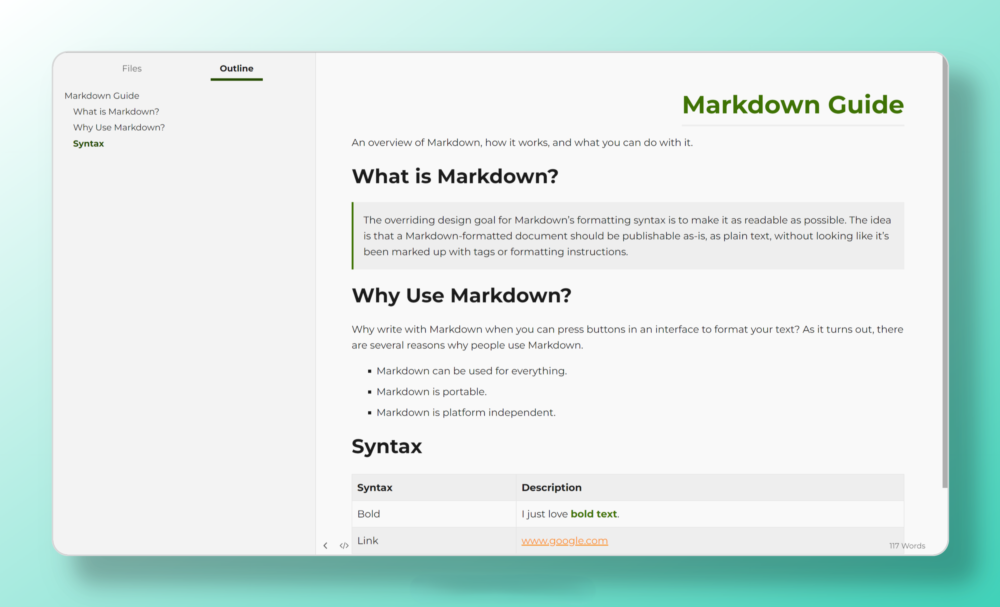

	<h1 align="center">Typora theme - Kiwi</h1>

    A green Typora theme like Kiwifruit🥝

<b><a href="README#screenshots">Screenshots</a></b>
|
<b><a href="README#installation">Installation</a></b>
|
<b><a href="README#tips">Tips</a></b>

    
  

## Screenshots

Light

Dark

You can use [md_syntax.md](https://github.com/snowzxl/typora-theme-kiwi/blob/main/md_syntax.md) file to preview other syntax styles.

## Installation

1. Clone the repository or download `typora-theme-kiwi.zip` from [Latest Release](https://github.com/snowzxl/typora-theme-kiwi/releases/latest).
2. Open Typora, go to `File` > `Preferences` > `Appearance`, click the "Open Theme Folder" button.
3. Copy the `kiwi.css` & `kiwi-dark.css` files and the `kiwi` folder into Typora's theme folder.
4. Restart Typora and select the **Kiwi** / **Kiwi Dark** theme from the theme menu.

## Tips

Font type:

- Latin font type [Montserrat](https://fonts.google.com/specimen/Montserrat);

- Chinese font type [LxgwWenKai](https://github.com/lxgw/LxgwWenKai);

- Monospace with font [Cascadia code](https://github.com/microsoft/cascadia-code) using in source code mode and fenced code blocks.

Code Syntax highlight:

- Code fences use [code-mirror.css](https://github.com/snowzxl/typora-theme-kiwi/blob/main/kiwi/code-mirror.css);
- source code mode use [sourcemode.css](https://github.com/snowzxl/typora-theme-kiwi/blob/main/kiwi/sourcemode.css).

Only tested on Windows, not tested on MacOS/Linux.

If you have any issues or suggestions, welcome to submit [Issues](https://github.com/snowzxl/typora-theme-kiwi/issues).

## Acknowledgements

Kiwi is inspired and guided by (and borrows elements from) some excellent works.

- [Typora Documents](https://theme.typora.io/doc/) for find how to write a theme
- [Nord](https://www.nordtheme.com/) syntax highlight
- [LxgwWenKai](https://github.com/lxgw/LxgwWenKai) and [Cascadia code ](https://github.com/microsoft/cascadia-code)for font type.

## License

Kiwi theme is licensed under the MIT License. You are free to use, modify, and distribute this theme.

---

If you like this theme, please [STAR me on Github](https://github.com/snowzxl/typora-theme-kiwi).
